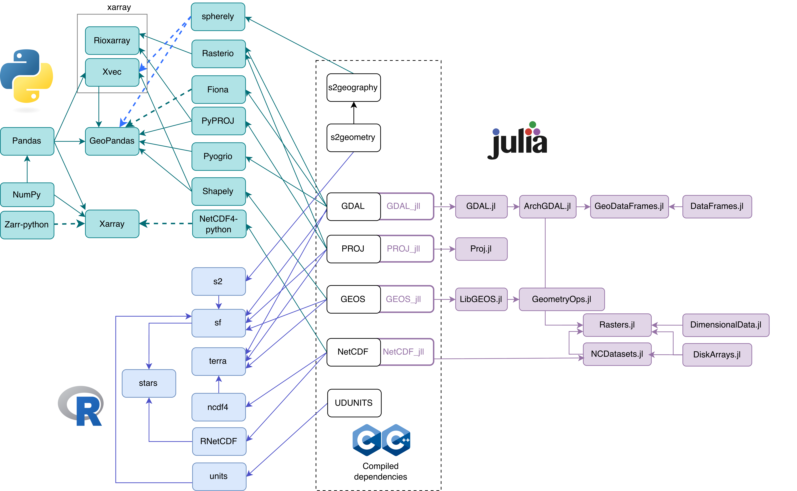

# sdsl: Spatial Data Science Languages

[source](geoPythonRJulia.graphio) for [graph](geoPythonRJulia.png)

Licensed under [CC-BY-SA](https://creativecommons.org/licenses/by-sa/4.0/deed.en).

Part of [Spatial Data Science Languages: commonalities and
needs](https://arxiv.org/pdf/2503.16686), by Pebesma, Fleischmann,
Parry, Nowosad, Graser, Dunnington, Pronk, Schouten, Lovelace,
Appel and Abad.
